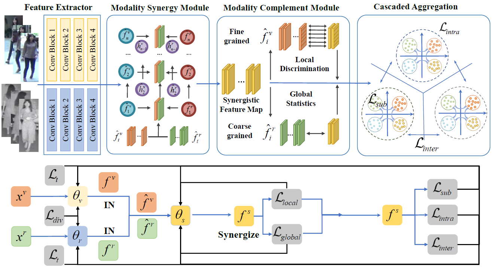

# MSCLNet for Visible-Infrared Person ReID (ECCV 2022)

Modality Synergy Complement Learning with Cascaded Aggregation for Visible-Infrared Person Re-Identification



## Getting Started
* Clone this repo: 

  `git clone https://github.com/bitreidgroup/VI-ReID-MSCLNet.git`

  `cd VI-ReID-MSCLNet`

* Create a conda environment and activate the environment
  `conda env create -f environment.yml`  
  
  `conda activate mscl` 

*We recommend Python = 3.6, CUDA = 10.0, Cudnn = 7.6.5, Pytorch = 1.2, and CudaToolkit = 10.0.130 for the environment.* 

## Preparing dataset

- **RegDB Dataset** :  The RegDB dataset can be downloaded from this [website](http://dm.dongguk.edu/link.html) by submitting a copyright form.

  (Named: "Dongguk Body-based Person Recognition Database (DBPerson-Recog-DB1)" on their website).

 	*We do not preprocess the RegDB dataset.* 

- **SYSU-MM01 Dataset** :  The SYSU-MM01 dataset can be downloaded from this [website](http://isee.sysu.edu.cn/project/RGBIRReID.htm). 

- We preprocess the SYSU-MM01 dataset to speed up the training process.

  - if you do not need  the identities of the cameras, run the [preprocess scripts](https://github.com/mangye16/Cross-Modal-Re-ID-baseline/blob/master/pre_process_sysu.py)

    `python pre_process_sysu.py`  

  After running, the training data will be stored in ".npy" format.

  - if your need the identities of the cameras, run :

    `python pre_process_sysu_cam.py` 

  The identities of cameras will be also stored in ".npy" format.

### Pre-trained Models and Reproduce our experimental results

*You may need manually define the data path in the `utils/data_loader.py` and `utils/data_manager.py` first.*

  ```bash
bash scripts/reproduce.sh 
  ```

### 4. Citation

If this repository helps your research, please cite :

```
@inproceedings{zhang2022mscl,
  title={Modality Synergy Complement Learning with Cascaded Aggregation for Visible-Infrared Person Re-Identification},
  author={Zhang, Yiyuan and Zhao, Sanyuan and Kang, Yuhao and Shen, Jianbing},
  booktitle={European Conference on Computer Vision (ECCV)},
  year={2022},
}
```

## Acknowledgement
Many thanks to the authors of [AGW](https://github.com/mangye16/Cross-Modal-Re-ID-baseline)